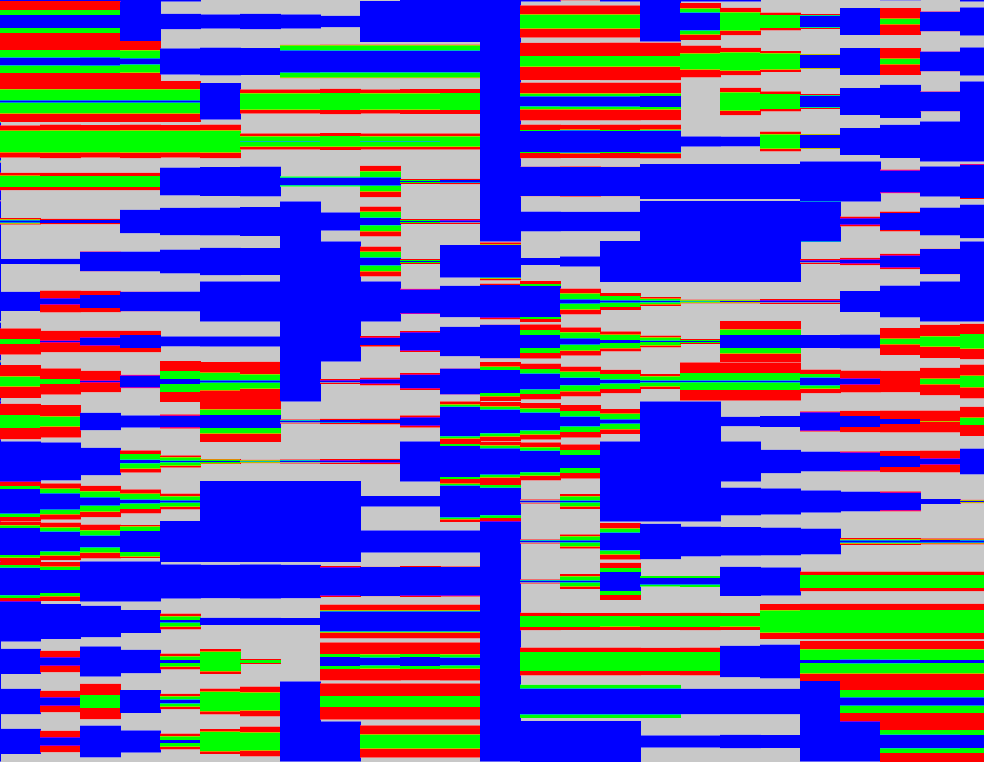

# pixelplotter

## Roadmap

### Colour
  - Swatch generators / helper tools. (You can break down colours using tertiary colors of different variety)

### Geometry
  - Implement Cairo render with threading for now. If it turns out to be too slow for prototyping we will need to move to NV_path_rendering.
  - Ability to interpolate shapes
  - Add pattern generators, copy, rotate etc. EG. Plaid Generator, Stripe/grid generator.

### Pixelate Filter
  - Create pixel class 
      -> Input Colour 
      -> Output colour seperation composition that becomes that colour seen from a large distance.
  - Pixel Designer UI

## dependencies

- ofxCv
- ofxOpenCv
- ofxImGui
- ofxPosterize

- K-Lite Codec Pack
